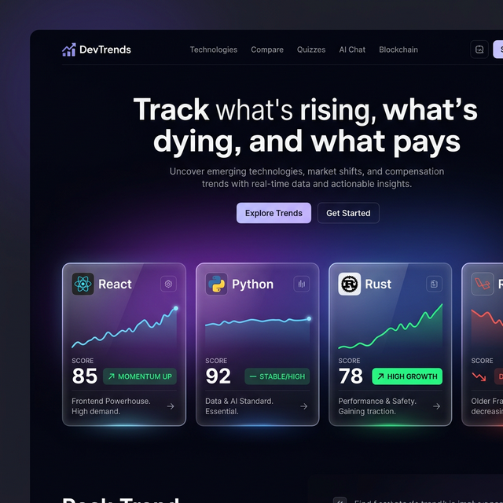
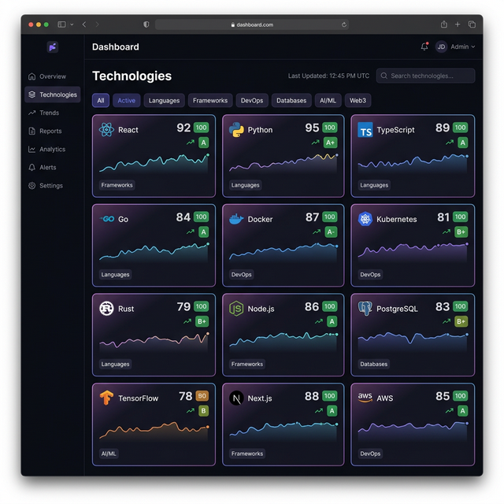
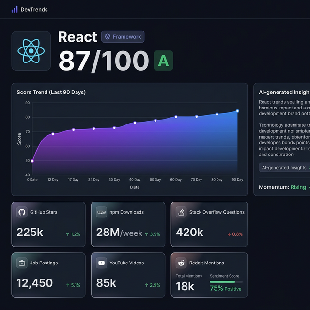
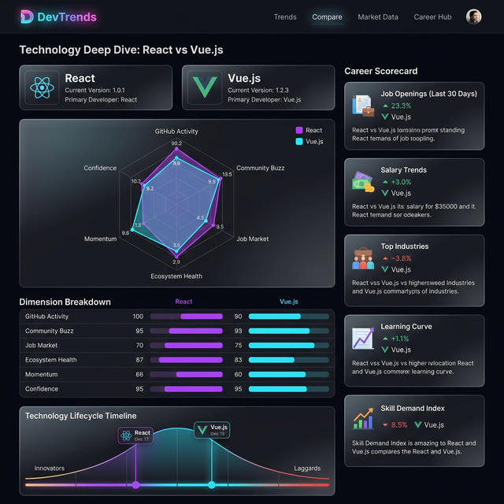
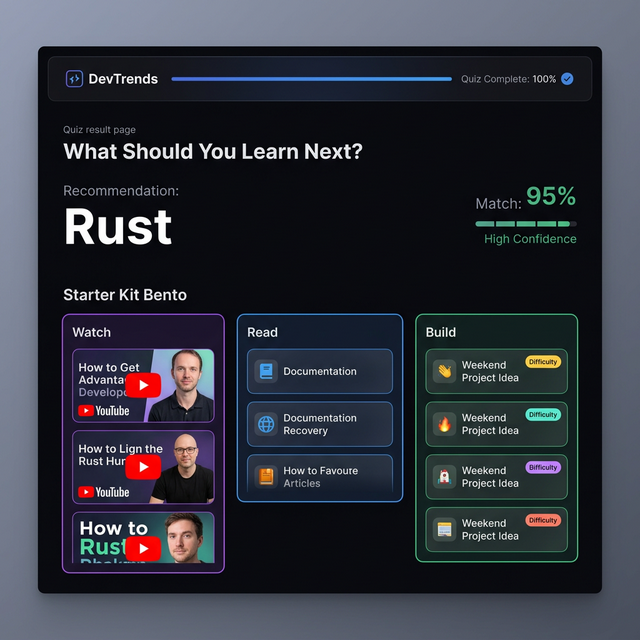
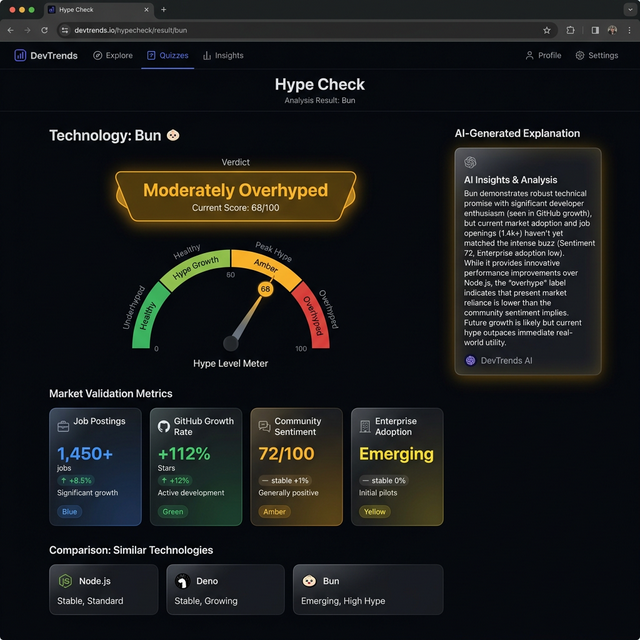
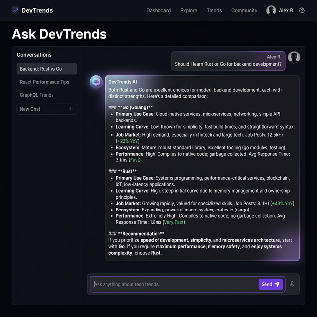
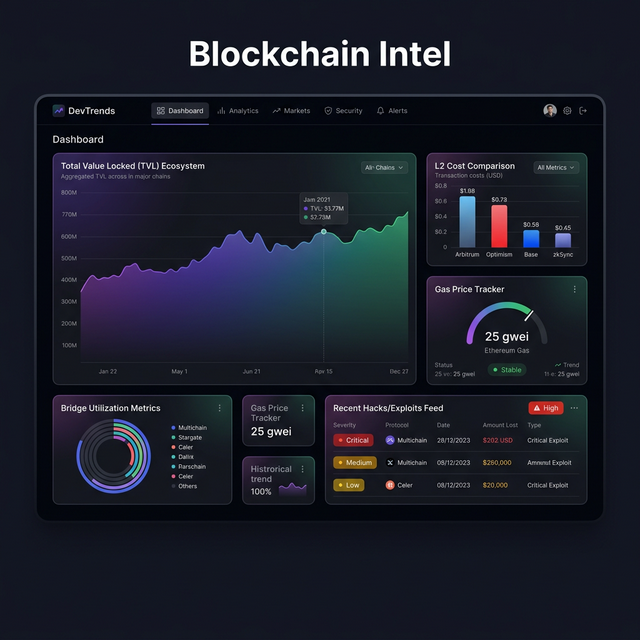
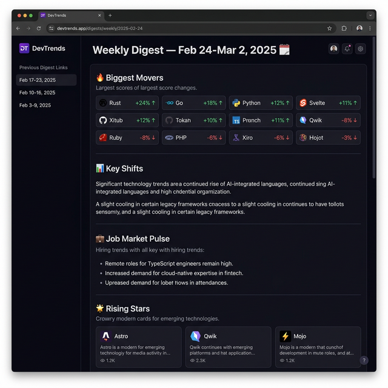

<div align="center">

<!-- PROJECT BANNER — replace with actual banner image -->
<!--  -->

```
██████╗ ███████╗██╗   ██╗████████╗██████╗ ███████╗███╗   ██╗██████╗ ███████╗
██╔══██╗██╔════╝██║   ██║╚══██╔══╝██╔══██╗██╔════╝████╗  ██║██╔══██╗██╔════╝
██║  ██║█████╗  ██║   ██║   ██║   ██████╔╝█████╗  ██╔██╗ ██║██║  ██║███████╗
██║  ██║██╔══╝  ╚██╗ ██╔╝   ██║   ██╔══██╗██╔══╝  ██║╚██╗██║██║  ██║╚════██║
██████╔╝███████╗ ╚████╔╝    ██║   ██║  ██║███████╗██║ ╚████║██████╔╝███████║
╚═════╝ ╚══════╝  ╚═══╝     ╚═╝   ╚═╝  ╚═╝╚══════╝╚═╝  ╚═══╝╚═════╝ ╚══════╝
```

### The Bloomberg Terminal for Tech Trends

**Track what's rising, what's dying, and what pays — across every major data source.**

<br/>

[](https://nextjs.org)
[](https://react.dev)
[](https://typescriptlang.org)
[](https://supabase.com)
[](https://vercel.com)

[](.)
[](./LICENSE)
[](./package.json)
[](./CONTRIBUTING.md)

<br/>

[](https://skillicons.dev)

</div>

---

## Why DevTrends?

Developers waste thousands of hours learning technologies that are declining in relevance, underpaid in the job market, or about to be replaced. The information exists — spread across GitHub stars, Stack Overflow questions, npm downloads, Reddit sentiment, YouTube tutorials, and job postings — but no one aggregates it into a single, actionable signal.

**DevTrends solves this.** It continuously pulls from 15 data sources, runs a multi-dimensional scoring pipeline, and surfaces career intelligence that a senior engineer would spend a week compiling manually — in seconds.

> *"Should I learn Rust or Go?" "Is Svelte a safe bet?" "Is Kubernetes still worth it in 2025?"*
>
> DevTrends answers these with data, not opinion.

---

## Features

| | Feature | Description |
|---|---|---|
| 📊 | **Composite Trend Scores** | Multi-source scoring with adaptive weights, Bayesian smoothing, and A-F confidence grades |
| 🤖 | **AI Intelligence Layer** | 7-provider AI system (Gemini, Groq, Mistral, xAI, Cerebras, OpenRouter, HuggingFace) with key rotation and circuit breakers |
| 🎯 | **Career Quizzes** | 6 decision engines: what to learn, which tech to pick, hype detection, stack audit, roadmap generator, Web3 path |
| 📈 | **Momentum Tracking** | Multi-window EMA trend classification (rising, stable, declining, volatile) across 3 time horizons |
| 🔀 | **Tech Comparison** | Side-by-side analysis with radar charts, dimension breakdown, lifecycle timelines, and career scorecards |
| 📺 | **YouTube Integration** | Video count, views, upload velocity, and curated learning resources per technology |
| 💼 | **Job Market Data** | Real job postings via Adzuna + JSearch correlated with tech scores |
| ⛓️ | **Blockchain / Web3** | TVL tracking, L2 cost comparison, gas prices, bridge utilization, hack feed |
| 🗂️ | **Language Rankings** | Weekly-updated programming language rankings from aggregated signals |
| 🔴 | **Trending Repos** | GitHub trending + legendary repositories with ecosystem mapping |
| 💬 | **AI Chatbot** | Conversational interface for natural language tech queries |
| 📰 | **Weekly Digest** | AI-generated digest of the week's biggest tech shifts |
| 🕹️ | **Starter Kit Bento** | Curated Watch / Read / Build resources for 67+ technologies |
| 🔄 | **Automated Data Pipeline** | 8 daily cron batches + 1 weekly batch, Vercel-scheduled |

---

## Tech Stack


</div>

| Layer | Technology | Purpose |
|-------|-----------|---------|
| **Framework** | Next.js 16.1.5 (App Router) | SSR, API routes, file-based routing |
| **Language** | TypeScript 5 (strict) | Full type safety end-to-end |
| **Styling** | Tailwind CSS 3.4 + CSS variables | Design system via HSL tokens |
| **Components** | shadcn/ui + Radix UI + CVA | Accessible, headless UI primitives |
| **Animations** | Framer Motion 12 | Reduced-motion-aware animations |
| **Charts** | Recharts 3 + D3 7 + Nivo | Line, bar, radar, heatmap charts |
| **Icons** | Lucide React + Simple Icons | Tech and UI icons |
| **Theme** | next-themes | Dark default, system-aware |
| **Database** | Supabase (PostgreSQL + Auth) | 15 tables, all RLS-enabled |
| **Data Fetching** | TanStack React Query 5 | Server state, background refetches |
| **Validation** | Zod 4 | Schema validation throughout |
| **Notifications** | Sonner | Toast notifications |
| **Env Safety** | @t3-oss/env-nextjs | Type-safe environment variables |
| **Sentiment** | wink-sentiment | Tech mention sentiment scoring |
| **Statistics** | simple-statistics | Z-score, EMA, Bayesian smoothing |
| **RSS** | rss-parser | Tech blog aggregation |
| **Testing** | Vitest + fast-check | Unit tests + property-based testing |
| **AI (Primary)** | Google Gemini (`@google/generative-ai`) | Insight generation, comparisons |
| **AI (Fallbacks)** | Groq, xAI, Mistral, Cerebras, OpenRouter, HuggingFace | Resilient multi-provider routing |
| **Dev Server** | Turbopack | Fast local iteration |
| **Prod Build** | Webpack | Optimized bundle splitting |
| **Deployment** | Vercel | Edge network, cron scheduling |

---

## Architecture

```
┌─────────────────────────────────────────────────────────────────────┐
│                          DEVTRENDS PLATFORM                         │
│                                                                     │
│   ┌─────────────┐    ┌──────────────────────────────────────────┐  │
│   │   Browser   │    │           Next.js 16 App Router           │  │
│   │             │◄──►│  Landing │ Dashboard (14 pages) │ APIs    │  │
│   └─────────────┘    └──────────────┬──────────┬────────────────┘  │
│                                     │          │                    │
│            ┌────────────────────────▼──┐  ┌───▼────────────────┐  │
│            │     Scoring Pipeline      │  │   AI System (7     │  │
│            │  ┌─────────────────────┐  │  │   Providers)       │  │
│            │  │ Composite Score     │  │  │  ┌──────────────┐  │  │
│            │  │ Adaptive Weights    │  │  │  │ Gemini       │  │  │
│            │  │ Enhanced Momentum   │  │  │  │ Groq         │  │  │
│            │  │ Confidence (A-F)    │  │  │  │ xAI / Grok   │  │  │
│            │  │ Bayesian Smoothing  │  │  │  │ Mistral      │  │  │
│            │  └─────────────────────┘  │  │  │ Cerebras     │  │  │
│            └───────────┬───────────────┘  │  │ OpenRouter   │  │  │
│                        │                  │  │ HuggingFace  │  │  │
│            ┌───────────▼───────────────┐  │  └──────────────┘  │  │
│            │   Data Pipeline           │  │  Key Rotation +    │  │
│            │   (8 daily cron batches)  │  │  Circuit Breaker   │  │
│            └───────────┬───────────────┘  └───────────────────┘  │
│                        │                                           │
│   ┌────────────────────▼──────────────────────────────────────┐   │
│   │                    15 Data Sources                        │   │
│   │                                                           │   │
│   │  GitHub  │  Hacker News  │  Stack Overflow  │  Dev.to    │   │
│   │  RSS Feeds  │  npm Registry  │  YouTube       │  Adzuna   │   │
│   │  Adzuna  │  JSearch      │  Remotive        │  DeFiLlama │   │
│   │  Libraries.io  │  GNews  │  NewsAPI                      │   │
│   └───────────────────────────────────────────────────────────┘   │
│                        │                                           │
│            ┌───────────▼───────────────┐                          │
│            │   Supabase (PostgreSQL)    │                          │
│            │   15 tables, all RLS       │                          │
│            └───────────────────────────┘                          │
└─────────────────────────────────────────────────────────────────────┘
```

---

## Project Structure

```
tracker_final/
├── src/
│   ├── app/
│   │   ├── (dashboard)/              # 14 dashboard pages (grouped layout)
│   │   │   ├── ask/                  # AI chatbot
│   │   │   ├── blockchain/           # Web3 intelligence
│   │   │   ├── compare/              # Side-by-side tech comparison
│   │   │   ├── digest/               # Weekly AI digest
│   │   │   ├── languages/            # Language rankings
│   │   │   ├── methodology/          # Scoring explainer
│   │   │   ├── monitoring/           # System monitoring
│   │   │   ├── quiz/
│   │   │   │   ├── decision/         # Which tech to pick?
│   │   │   │   ├── hype-check/       # Is it overhyped?
│   │   │   │   ├── learn-next/       # What to learn next?
│   │   │   │   ├── roadmap/          # Learning roadmap generator
│   │   │   │   ├── stack-health/     # Stack audit
│   │   │   │   └── web3-path/        # Web3 learning path
│   │   │   ├── repos/                # Trending GitHub repos
│   │   │   └── technologies/[slug]/  # Tech detail pages
│   │   ├── api/                      # 40+ API routes
│   │   │   ├── ai/                   # AI insight endpoints
│   │   │   ├── cron/                 # Scheduled data fetchers
│   │   │   ├── quiz/                 # Quiz data APIs
│   │   │   ├── technologies/         # Tech data APIs
│   │   │   └── blockchain/           # Web3 data APIs
│   │   └── page.tsx                  # Landing page
│   │
│   ├── components/                   # 192 component files
│   │   ├── ui/                       # 45+ shadcn + custom primitives
│   │   ├── technologies/             # Tech listing + detail (30+)
│   │   ├── compare/                  # Comparison UI (15+)
│   │   ├── blockchain/               # Web3 charts (12+)
│   │   ├── quiz/                     # Quiz result components
│   │   ├── landing/                  # Homepage sections
│   │   └── shared/                   # Shared layout components
│   │
│   ├── lib/
│   │   ├── ai/
│   │   │   ├── generators/           # tech-insight, comparison, digest, recommendation…
│   │   │   ├── providers/            # 7 AI provider implementations
│   │   │   ├── router.ts             # UseCase → provider routing (12 use cases)
│   │   │   ├── resilient-call.ts     # Key rotation + retry + circuit breaker
│   │   │   ├── key-manager.ts        # 8 keys across 7 providers
│   │   │   ├── rate-limiter.ts       # Per-client rate limiting
│   │   │   ├── quality-monitor.ts    # Output quality checks
│   │   │   ├── telemetry.ts          # Cost + latency tracking
│   │   │   └── safety.ts             # Input sanitization
│   │   ├── scoring/
│   │   │   ├── pipeline.ts           # Main scoring orchestrator
│   │   │   ├── composite.ts          # Score aggregation
│   │   │   ├── adaptive-weights.ts   # Category + maturity weights
│   │   │   ├── enhanced-momentum.ts  # Multi-window EMA
│   │   │   ├── confidence.ts         # A-F confidence grades
│   │   │   └── bayesian.ts           # Bayesian smoothing
│   │   ├── api/                      # 15 data source integrations
│   │   │   ├── github.ts
│   │   │   ├── youtube.ts
│   │   │   ├── stackoverflow.ts
│   │   │   └── [12 more…]
│   │   └── quiz/                     # Quiz decision engines
│   │       ├── decision-engine.ts
│   │       ├── learn-next-engine.ts
│   │       ├── hype-check-engine.ts
│   │       ├── stack-health-engine.ts
│   │       ├── roadmap-engine.ts
│   │       └── resources.ts          # 67 curated techs with video/docs/project
│   │
│   └── types/index.ts                # All shared TypeScript types
│
├── .env.example                      # Environment variable template
├── next.config.ts                    # Next.js + Webpack config
├── tailwind.config.ts                # Design system config
├── vitest.config.ts                  # Test configuration
├── vercel.json                       # Deployment + cron schedule
└── components.json                   # shadcn/ui config
```

---

## Prerequisites

- **Node.js** 18.17+ (LTS recommended)
- **npm** 9+ or **pnpm** 8+
- **Supabase** account — [supabase.com](https://supabase.com) (free tier works)
- **GitHub Personal Access Token** — `public_repo` scope
- **Google Gemini API key** — [aistudio.google.com](https://aistudio.google.com) (free tier, for AI features)
- One job API: **Adzuna** or **RapidAPI/JSearch**

Optional but recommended for full data coverage:
- Stack Overflow API key (10k req/day with key vs 300 without)
- Reddit API credentials (60 req/min with OAuth)
- YouTube Data API v3 key (10k quota/day free)

---

## Installation & Setup

### 1. Clone the repository

```bash
git clone https://github.com/your-username/devtrends.git
cd devtrends
```

### 2. Install dependencies

```bash
npm install
```

### 3. Configure environment variables

```bash
cp .env.example .env.local
```

Fill in `.env.local` — see the [Environment Variables](#environment-variables) table below.

### 4. Set up Supabase

1. Create a new project at [supabase.com](https://supabase.com)
2. Copy your URL, anon key, and service role key into `.env.local`
3. Apply the database schema by running the SQL migrations in the Supabase SQL editor

The schema creates 15 tables: `technologies`, `data_points`, `data_points_latest`, `daily_scores`, `fetch_logs`, `ai_insights`, `momentum_analysis`, `anomaly_events`, `tech_relationships`, `insight_feedback`, `prompt_versions`, `weekly_digests`, `conversations`, `rate_limits`, `ai_telemetry`, `system_config`.

### 5. Start the development server

```bash
npm run dev
```

Open [http://localhost:3000](http://localhost:3000). The dev server uses **Turbopack** for fast HMR.

---

## Environment Variables

Copy `.env.example` to `.env.local`. **Never commit `.env.local`** — it's in `.gitignore`.

### Core (Required)

| Variable | Description | Where to get it |
|----------|-------------|-----------------|
| `NEXT_PUBLIC_SUPABASE_URL` | Supabase project URL (browser-safe) | Supabase → Project Settings → API |
| `NEXT_PUBLIC_SUPABASE_ANON_KEY` | Supabase anonymous key (browser-safe) | Same as above |
| `SUPABASE_SERVICE_ROLE_KEY` | Service role key — **server only, never expose** | Same as above |
| `GITHUB_TOKEN` | Personal access token (`public_repo` scope) | [github.com/settings/tokens](https://github.com/settings/tokens) |
| `STACKOVERFLOW_API_KEY` | Stack Exchange API key | [stackapps.com](https://stackapps.com/apps/oauth/register) |
| `REDDIT_CLIENT_ID` | Reddit app client ID *(optional — platform works without it)* | [reddit.com/prefs/apps](https://www.reddit.com/prefs/apps) |
| `REDDIT_CLIENT_SECRET` | Reddit app client secret *(optional)* | Same as above |
| `ADZUNA_APP_ID` | Adzuna job API app ID | [developer.adzuna.com](https://developer.adzuna.com) |
| `ADZUNA_API_KEY` | Adzuna job API key | Same as above |
| `RAPIDAPI_KEY` | RapidAPI key (for JSearch) | [rapidapi.com](https://rapidapi.com) |
| `GEMINI_API_KEY` | Google Gemini API key — primary AI provider | [aistudio.google.com](https://aistudio.google.com) |

### AI Providers (at least one fallback recommended)

| Variable | Description | Where to get it |
|----------|-------------|-----------------|
| `GEMINI_API_KEY_2` | Second Gemini key for key rotation | [aistudio.google.com](https://aistudio.google.com) |
| `GROQ_API_KEY` | Groq API key (fast inference) | [console.groq.com](https://console.groq.com) |
| `XAI_API_KEY` | xAI Grok API key | [x.ai](https://x.ai) |
| `MISTRAL_API_KEY` | Mistral API key | [console.mistral.ai](https://console.mistral.ai) |
| `CEREBRAS_API_KEY` | Cerebras API key | [inference.cerebras.ai](https://inference.cerebras.ai) |
| `OPENROUTER_API_KEY` | OpenRouter key | [openrouter.ai](https://openrouter.ai) |
| `HUGGINGFACE_API_KEY` | HuggingFace Inference API key | [huggingface.co/settings/tokens](https://huggingface.co/settings/tokens) |

### Optional

| Variable | Description | Where to get it |
|----------|-------------|-----------------|
| `YOUTUBE_API_KEY` | YouTube Data API v3 (10k quota/day) | [console.cloud.google.com](https://console.cloud.google.com) |
| `DEVTO_API_KEY` | Dev.to API key (works without it) | [dev.to/settings/extensions](https://dev.to/settings/extensions) |
| `NEWSAPI_KEY` | NewsAPI key | [newsapi.org](https://newsapi.org/register) |
| `GNEWS_API_KEY` | GNews API key | [gnews.io](https://gnews.io) |
| `LIBRARIESIO_API_KEY` | Libraries.io API key | [libraries.io/api](https://libraries.io/api) |
| `NPM_TOKEN` | npm auth token (public data works without) | [npmjs.com/settings/tokens](https://www.npmjs.com/settings/~/tokens) |
| `SENTRY_DSN` | Sentry error tracking | [sentry.io](https://sentry.io) |
| `NEXT_PUBLIC_POSTHOG_KEY` | PostHog product analytics | [posthog.com](https://posthog.com) |
| `RESEND_API_KEY` | Resend email delivery (3k emails/mo free) | [resend.com](https://resend.com) |

---

## How to Run

### Development

```bash
npm run dev
```

Starts on `http://localhost:3000` using **Turbopack** for fast HMR.

### Production Build

```bash
npm run build
npm start
```

Uses **Webpack** with optimized bundle splitting. If something works in dev but fails build, check Webpack compatibility — these are different bundlers.

### Linting

```bash
npm run lint
```

ESLint with Next.js config. Fix all errors before pushing.

### Tests

```bash
npm run test          # Run once
npm run test:watch    # Watch mode
```

**Vitest** with **fast-check** for property-based testing.

### Triggering Data Fetches Manually

Cron jobs run automatically on Vercel (configured in `vercel.json`). To trigger manually during development, call the routes in order:

```bash
# Data collection batches
curl http://localhost:3000/api/cron/fetch-daily/batch-1    # GitHub + repos
curl http://localhost:3000/api/cron/fetch-daily/batch-2    # Hacker News, Dev.to, RSS
curl http://localhost:3000/api/cron/fetch-daily/batch-3    # Stack Overflow
curl http://localhost:3000/api/cron/fetch-daily/batch-4a   # Reddit
curl http://localhost:3000/api/cron/fetch-daily/batch-4b   # npm downloads
curl http://localhost:3000/api/cron/fetch-daily/batch-5-blockchain  # Web3 / DeFiLlama
curl http://localhost:3000/api/cron/fetch-daily/batch-6-youtube     # YouTube Data API

# Processing
curl http://localhost:3000/api/cron/fetch-daily/batch-intelligence  # AI insight generation
curl http://localhost:3000/api/cron/fetch-daily/batch-scoring       # Score computation
```

---

## Screenshots

> **Note:** Replace these placeholders with actual screenshots once deployed.

<!-- Landing page hero with trending tech cards -->


<!-- Technologies listing with score cards, filters, and trend indicators -->


<!-- Technology detail page: score breakdown + 90-day trend chart + signals -->


<!-- Side-by-side comparison with radar chart and dimension breakdown -->


<!-- Learn Next quiz result with StarterKitBento (Watch/Read/Build) -->


<!-- Hype Check quiz showing verdict + market validation -->


<!-- AI chatbot interface -->


<!-- Blockchain / Web3 intelligence dashboard: TVL, gas, L2 costs -->


<!-- Weekly AI digest -->


---

## API Reference

All routes live under `/api/`. Server routes use `createSupabaseAdminClient()` for writes and `createSupabaseServerClient()` for SSR reads.

### Technologies

| Method | Endpoint | Description |
|--------|----------|-------------|
| `GET` | `/api/technologies` | All 117 technologies with current scores |
| `GET` | `/api/technologies/[slug]` | Full tech detail: scores, signals, metadata |
| `GET` | `/api/technologies/[slug]/chart` | Score history for charts (30/90/365 days) |
| `GET` | `/api/technologies/[slug]/stars` | GitHub star history |
| `GET` | `/api/technologies/[slug]/jobs` | Job postings for this technology |
| `GET` | `/api/technologies/movers` | Top gainers and losers this week |
| `GET` | `/api/technologies/stats` | Platform-wide statistics |

### AI Insights

| Method | Endpoint | Description |
|--------|----------|-------------|
| `GET` | `/api/ai/insights/[slug]` | Cached AI analysis for a technology |
| `POST` | `/api/ai/compare` | AI comparison of two technologies |
| `POST` | `/api/ai/ask` | Conversational AI query |
| `GET` | `/api/ai/digest/latest` | Latest weekly digest |
| `GET` | `/api/ai/recommend` | Tech recommendation |
| `POST` | `/api/ai/feedback` | Submit thumbs up/down on an insight |
| `GET` | `/api/ai/health` | AI system health + provider status |

### Quiz

| Method | Endpoint | Description |
|--------|----------|-------------|
| `POST` | `/api/quiz/projects` | Generate AI weekend project ideas |

**Query params for `/api/quiz/projects`:**
```
?slug=react&goal=build-a-portfolio&level=intermediate
```

Results are cached 30 days in `ai_insights` with `insight_type = 'project-idea'`.

### Cron Batches

All cron routes run on Vercel's scheduler. Run manually for local development.

| Endpoint | Schedule | Sources |
|----------|----------|---------|
| `/api/cron/fetch-daily/batch-1` | Daily | GitHub trending + repos |
| `/api/cron/fetch-daily/batch-2` | Daily | Hacker News, Dev.to, RSS |
| `/api/cron/fetch-daily/batch-3` | Daily | Stack Overflow |
| `/api/cron/fetch-daily/batch-4a` | Daily | Reddit |
| `/api/cron/fetch-daily/batch-4b` | Daily | npm downloads |
| `/api/cron/fetch-daily/batch-5-blockchain` | Daily | DeFiLlama, L2Beat, Web3 |
| `/api/cron/fetch-daily/batch-6-youtube` | Daily | YouTube Data API v3 |
| `/api/cron/fetch-daily/batch-intelligence` | Daily | AI insight generation |
| `/api/cron/fetch-daily/batch-scoring` | Daily | Score computation |
| `/api/cron/fetch-weekly` | Weekly | Digest generation |

---

## Database Schema

15 Supabase tables, all with Row Level Security enabled.

| Table | Purpose |
|-------|---------|
| `technologies` | 117 techs: name, slug, category, maturity |
| `data_points` | Raw signals from all 15 data sources |
| `data_points_latest` | View: most recent data point per tech per metric |
| `daily_scores` | Computed composite scores per day |
| `fetch_logs` | Data fetch audit trail |
| `ai_insights` | Generated AI analysis + cached project ideas |
| `momentum_analysis` | Multi-window trend analysis (unique on `technology_id, analysis_date`) |
| `anomaly_events` | Detected statistical anomalies |
| `tech_relationships` | Tech similarity + dependency graph |
| `insight_feedback` | User thumbs up/down on AI insights |
| `prompt_versions` | Versioned prompt templates |
| `weekly_digests` | Archived weekly digest content |
| `conversations` | Chat session history |
| `rate_limits` | Per-client API rate limit state |
| `ai_telemetry` | AI call costs and latency |
| `system_config` | Global key-value configuration |

**Key rules:**
- Always query `data_points_latest` with the `metadata` column (required for YouTube `top_videos`)
- `momentum_analysis` unique constraint on `(technology_id, analysis_date)` — always upsert
- Use `createSupabaseAdminClient()` for server writes; `createSupabaseServerClient()` for SSR reads

---

## Scoring System

Every technology gets a **composite score (0–100)** built from four weighted dimensions:

| Dimension | Default Weight | Sources |
|-----------|---------------|---------|
| **GitHub Activity** | 25% | Stars, forks, issues, contributors, commit velocity |
| **Community Buzz** | 20% | Hacker News, Reddit, Dev.to mentions + sentiment |
| **Job Market** | 25% | Adzuna, JSearch, Remotive job postings |
| **Ecosystem Health** | 30% | npm downloads, SO questions, library dependents |

Weights are **adaptive** — they shift per technology category and maturity stage. A new language is weighted differently than a mature enterprise framework.

On top of the composite score:

- **Momentum** (−100 to +100) — multi-window EMA across 7/30/90-day horizons, trend classification: `rising | stable | declining | volatile`
- **Confidence grade** (A–F) — statistical reliability of the score based on data completeness
- **Bayesian smoothing** — prevents score volatility from single-source noise
- **Anomaly detection** — flags statistical outliers for AI explanation

---

## Contributing

Contributions are welcome. Please follow these guidelines.

### Workflow

1. Fork the repository
2. Create a feature branch: `git checkout -b feat/your-feature`
3. Make changes following the conventions below
4. Run tests: `npm run test`
5. Run linting: `npm run lint`
6. Commit: `git commit -m "feat: add X"`
7. Open a pull request

### Code conventions

- **`'use client'`** — only for hooks, event handlers, browser APIs, Framer Motion, or Recharts
- **Path aliases** — always `@/*`; never relative cross-directory imports
- **Animations** — always check `useReducedMotion()` before animating
- **AI calls** — always use `resilientAICall()`, never call providers directly
- **Supabase** — `createSupabaseAdminClient()` for server writes; `createSupabaseServerClient()` for SSR reads only
- **Import order**: React → external libs → `@/lib` → `@/components` → `@/hooks` → `import type`
- **Naming**: `PascalCase.tsx` for components, `useXxx.ts` for hooks, `camelCase.ts` for lib files

### Adding a new data source

1. Create a fetcher in `src/lib/api/your-source.ts`
2. Add it to the appropriate cron batch in `src/app/api/cron/fetch-daily/`
3. Add a `DataSource` variant to `src/types/index.ts`
4. Map signals to the scoring pipeline in `src/lib/scoring/composite.ts`

### Adding a new AI generator

1. Create the generator in `src/lib/ai/generators/`
2. Add a `UseCase` to `router.ts` union + `ROUTING_TABLE`
3. Create an API route in `src/app/api/ai/`
4. Always wrap with `resilientAICall()` and sanitize with `safety.ts`

### What not to do

- Do not add Redux, Zustand, or global state libraries — React Query handles server state
- Do not use Python — all algorithms live in TypeScript via `simple-statistics` and `wink-sentiment`
- Do not read from `process.env` directly — go through `@t3-oss/env-nextjs`
- Do not call AI providers directly — use `resilientAICall()`
- Do not use `img.youtube.com` for thumbnails — use `i.ytimg.com` with `referrerPolicy="no-referrer"`

---

## Project Stats

| Metric | Count |
|--------|-------|
| Technologies tracked | 117 |
| Technology categories | 8 |
| Dashboard pages | 14 |
| API endpoints | 40+ |
| React components | 192 |
| UI primitives | 45+ |
| Data source integrations | 15 |
| AI providers | 7 |
| AI use case routes | 12 |
| Database tables | 15 |
| Quiz types | 6 |
| Curated resources (resources.ts) | 67 techs |
| Daily cron batches | 8 |
| Direct dependencies | 51 |

---

## Roadmap

- [x] **Phase 1 — Scoring Engine:** Composite scores, adaptive weights, momentum, Bayesian smoothing, confidence grades, Supabase schema
- [x] **Phase 2 — AI Layer:** 7-provider AI system, key rotation, circuit breaker, rate limiting, telemetry, insight generators
- [x] **Phase 3 — Full Platform:** 14 dashboard pages, 6 quiz types, comparison engine, YouTube integration, blockchain intelligence, trending repos
- [ ] **Phase 4 — Auth + Personalization:** Login/signup UI, saved searches, custom alerts (Supabase Auth backend exists)
- [ ] **Phase 5 — Observability:** Sentry error monitoring, PostHog analytics, email delivery via Resend
- [ ] **Phase 6 — Scale:** Public API, mobile app, test coverage expansion

---

## License

This project is licensed under the MIT License. See [LICENSE](./LICENSE) for details.

---

<div align="center">

**Built for developers who make decisions with data, not hype.**

[Live Demo](https://devtrends.app) · [Report a Bug](https://github.com/your-username/devtrends/issues) · [Request a Feature](https://github.com/your-username/devtrends/issues)

</div>
