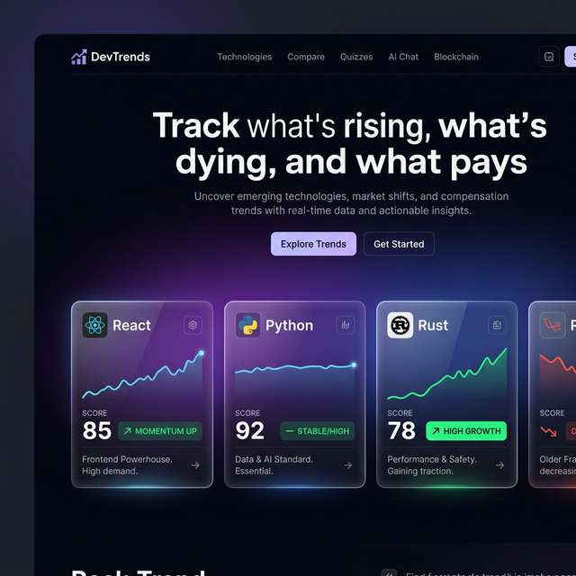
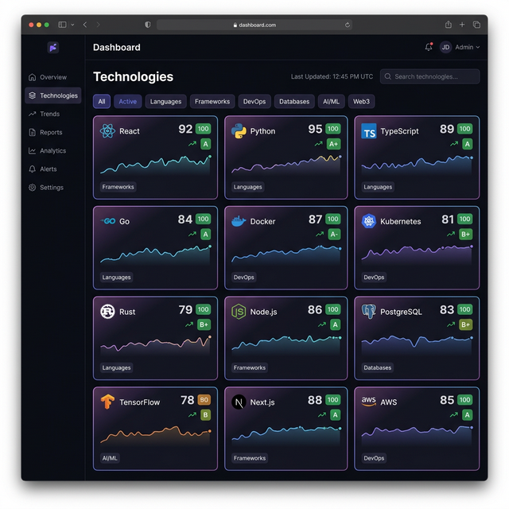
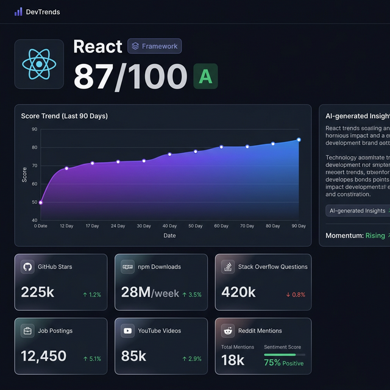
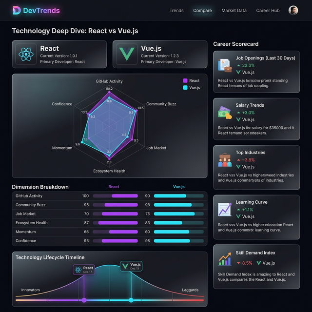
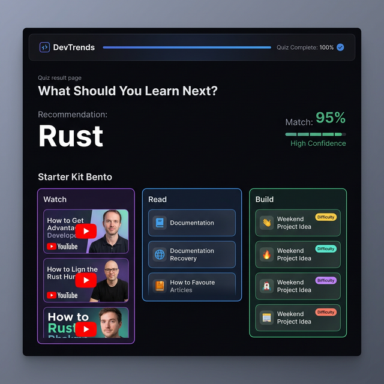
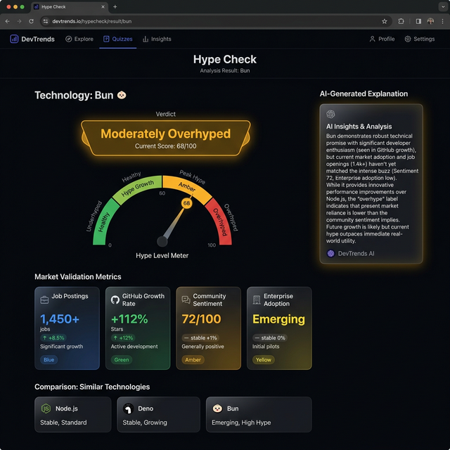
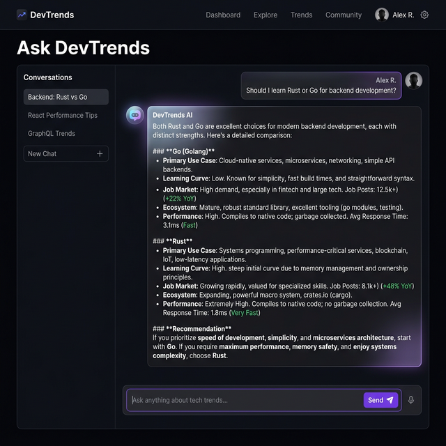
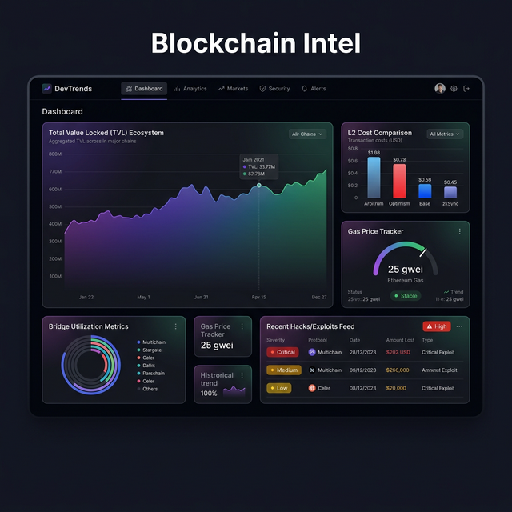
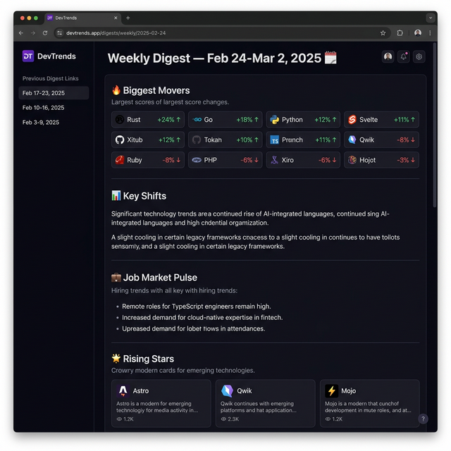

<div align="center">

<!-- PROJECT BANNER -->
<!--  -->

```text
██████╗ ███████╗██╗   ██╗████████╗██████╗ ███████╗███╗   ██╗██████╗ ███████╗
██╔══██╗██╔════╝██║   ██║╚══██╔══╝██╔══██╗██╔════╝████╗  ██║██╔══██╗██╔════╝
██║  ██║█████╗  ██║   ██║   ██║   ██████╔╝█████╗  ██╔██╗ ██║██║  ██║███████╗
██║  ██║██╔══╝  ╚██╗ ██╔╝   ██║   ██╔══██╗██╔══╝  ██║╚██╗██║██║  ██║╚════██║
██████╔╝███████╗ ╚████╔╝    ██║   ██║  ██║███████╗██║ ╚████║██████╔╝███████║
╚═════╝ ╚══════╝  ╚═══╝     ╚═╝   ╚═╝  ╚═╝╚══════╝╚═╝  ╚═══╝╚═════╝ ╚══════╝
```

### Developer Career Intelligence

**Track what is rising, what is cooling off, and what is worth learning across live engineering, jobs, and blockchain signals.**

<br/>

[](https://nextjs.org)
[](https://react.dev)
[](https://typescriptlang.org)
[](https://supabase.com)
[](https://vercel.com)

[](./package.json)
[](.)
[](.)

<br/>

[](https://skillicons.dev)

[Live Demo](https://devtrends.dev) · [Repository](https://github.com/Surge77/social-media-tracker)

</div>

---

## Documentation

Contributor documentation now lives in the Docusaurus app under `apps/docs`.

- Run locally with `npm run docs:dev`
- Build with `npm run docs:build`
- Use the published docs for onboarding, architecture, subsystem guides, and contributor workflow

---

## Why DevTrends?

Developers make career bets with fragmented information. GitHub shows one signal, job boards show another, community buzz shows a third, and blockchain ecosystems behave like a separate market entirely.

**DevTrends pulls those signals into one product.** It collects data from engineering communities, package ecosystems, job sources, and DeFiLlama-backed blockchain feeds, then turns them into rankings, comparisons, AI-assisted analysis, weekly digests, and quiz-style decision flows.

> *"Should I learn Go or Rust?"*  
> *"Is this framework gaining real hiring demand or just hype?"*  
> *"Which blockchain ecosystem is actually showing durable usage?"*
>
> DevTrends is built to answer those questions with data instead of vibes.

---

## Features

| | Feature | Description |
|---|---|---|
| 📊 | **Trend Scoring** | Daily scoring pipeline for technologies instead of static editorial lists |
| 🤖 | **AI Intelligence Layer** | AI-assisted summaries, comparisons, recommendations, digest generation, and chat |
| 🎯 | **Career Quizzes** | Decision flows for learning direction, hype checks, stack health, and roadmap-style guidance |
| 🔀 | **Tech Comparison** | Side-by-side comparison surfaces for competing technologies |
| 💼 | **Jobs Intelligence** | Hiring signals and jobs-focused trend routes |
| ⛓️ | **Blockchain Dashboard** | Chain TVL, protocol health, bridge leaderboard, gas data, and ecosystem snapshots |
| 🗂️ | **Language Rankings** | Language pages and ranking-related ingestion routes |
| 🔴 | **Trending Repositories** | Repo discovery and curated repository views |
| 📰 | **Weekly Digest** | Scheduled digest generation and summary surfaces |
| 🧪 | **Autoresearch Loops** | Guarded evaluation workflows for scoring and routing experiments |
| 🔄 | **Cron Pipeline** | Daily and weekly scheduled routes for ingestion and recomputation |
| 📈 | **Benchmark CLI** | Local benchmark script for measuring key routes and loading behavior |

---

## Product Areas

The current dashboard surface includes 11 main areas under `src/app/(dashboard)`:

- Ask AI
- Blockchain
- Compare
- Digest
- Jobs
- Languages
- Methodology
- Monitoring
- Quiz
- Repos
- Technologies

The technology icon mapping currently covers **117 technologies**, based on [src/lib/tech-icons.ts](C:/Users/tdmne/OneDrive/Desktop/tracker_final/src/lib/tech-icons.ts).

---

## Tech Stack

| Layer | Technology | Purpose |
|-------|-----------|---------|
| **Framework** | Next.js 16 App Router | Pages, routing, APIs, and SSR |
| **Language** | TypeScript | Application code and type-safe utilities |
| **Styling** | Tailwind CSS | Design system and UI layout |
| **State / Fetching** | TanStack Query | Client-side server state and refresh behavior |
| **Database** | Supabase | Data storage, server access, and scheduled pipeline persistence |
| **Charts / Viz** | Recharts, D3, Nivo | Data visualization across dashboards |
| **Animation** | Framer Motion | UI animation where needed |
| **Validation** | Zod | Runtime validation for typed inputs and config |
| **Testing** | Vitest + fast-check | Unit tests and property-based checks |
| **Automation** | Vercel Cron | Daily and weekly scheduled jobs |
| **Benchmarking** | Puppeteer | Local route benchmarking via CLI |

---

## Architecture

```text
┌─────────────────────────────────────────────────────────────────────┐
│                          DEVTRENDS PLATFORM                         │
│                                                                     │
│   ┌─────────────┐    ┌──────────────────────────────────────────┐  │
│   │   Browser   │◄──►│         Next.js App Router Pages         │  │
│   └─────────────┘    │ Landing │ Dashboard │ API routes         │  │
│                      └──────────────┬───────────────┬───────────┘  │
│                                     │               │              │
│                      ┌──────────────▼──────┐  ┌────▼────────────┐ │
│                      │   Scoring / Trends  │  │   AI Layer      │ │
│                      │ composite scoring   │  │ compare / ask   │ │
│                      │ momentum / ranking  │  │ digest / recs   │ │
│                      └──────────────┬──────┘  └────┬────────────┘ │
│                                     │               │              │
│                      ┌──────────────▼────────────────▼──────────┐  │
│                      │        Data + Cron Ingestion Layer       │  │
│                      │ GitHub | Reddit | Stack Overflow | Jobs  │  │
│                      │ npm | Dev.to | RSS | YouTube | DeFiLlama │  │
│                      └──────────────┬────────────────────────────┘  │
│                                     │                               │
│                      ┌──────────────▼───────────────┐               │
│                      │      Supabase / system data  │               │
│                      └──────────────────────────────┘               │
└─────────────────────────────────────────────────────────────────────┘
```

---

## Project Structure

```text
tracker_final/
├── src/
│   ├── app/              # Next.js pages and API handlers
│   ├── components/       # UI and page-level components
│   ├── hooks/            # React hooks
│   ├── lib/              # scoring, AI, fetchers, jobs, blockchain, utilities
│   └── types/            # shared TypeScript types
├── scripts/              # benchmark and autoresearch helpers
├── supabase/             # SQL migrations
├── autoresearch/         # fixtures, manifest, evaluation workspace
├── assets/screenshots/   # README screenshots
├── docs/                 # supporting docs
├── .env.example
├── package.json
├── vercel.json
└── vitest.config.ts
```

Useful folders:

- [src/app](C:/Users/tdmne/OneDrive/Desktop/tracker_final/src/app)
- [src/components](C:/Users/tdmne/OneDrive/Desktop/tracker_final/src/components)
- [src/lib](C:/Users/tdmne/OneDrive/Desktop/tracker_final/src/lib)
- [scripts](C:/Users/tdmne/OneDrive/Desktop/tracker_final/scripts)
- [supabase/migrations](C:/Users/tdmne/OneDrive/Desktop/tracker_final/supabase/migrations)
- [autoresearch](C:/Users/tdmne/OneDrive/Desktop/tracker_final/autoresearch)

---

## Quick Start

### Prerequisites

- Node.js 20+
- npm
- A Supabase project
- API credentials for the sources you want to enable

### 1. Clone the repository

```bash
git clone https://github.com/Surge77/social-media-tracker.git
cd social-media-tracker
```

### 2. Install dependencies

```bash
npm install
```

### 3. Configure environment variables

```bash
cp .env.example .env.local
```

Start with the essentials:

- `NEXT_PUBLIC_SUPABASE_URL`
- `NEXT_PUBLIC_SUPABASE_ANON_KEY`
- `SUPABASE_SERVICE_ROLE_KEY`
- `GITHUB_TOKEN`
- `STACKOVERFLOW_API_KEY`
- `REDDIT_CLIENT_ID`
- `REDDIT_CLIENT_SECRET`

Optional integrations for jobs, blockchain, and AI live in [.env.example](C:/Users/tdmne/OneDrive/Desktop/tracker_final/.env.example).

### 4. Apply database migrations

Run the SQL files in [supabase/migrations](C:/Users/tdmne/OneDrive/Desktop/tracker_final/supabase/migrations) against your Supabase project.

### 5. Start the development server

```bash
npm run dev
```

The app runs at `http://127.0.0.1:3000`.

---

## Environment Variables

The template in [.env.example](C:/Users/tdmne/OneDrive/Desktop/tracker_final/.env.example) now matches the variables the app actually reads.

### Core

| Variable | Purpose |
|----------|---------|
| `NEXT_PUBLIC_SUPABASE_URL` | Supabase project URL |
| `NEXT_PUBLIC_SUPABASE_ANON_KEY` | Browser-safe Supabase anon key |
| `SUPABASE_SERVICE_ROLE_KEY` | Server-side Supabase service key |
| `NEXT_PUBLIC_APP_URL` | Optional base URL override for cron fan-out |
| `CRON_SECRET` | Internal cron authentication in production |
| `ADMIN_API_SECRET` | Admin route protection |

### Source integrations

| Area | Variables |
|------|-----------|
| GitHub | `GITHUB_TOKEN` |
| Stack Overflow | `STACKOVERFLOW_API_KEY` |
| Reddit | `REDDIT_CLIENT_ID`, `REDDIT_CLIENT_SECRET`, `REDDIT_USER_AGENT` |
| Dev.to | `DEVTO_API_KEY` |
| Jobs | `ADZUNA_APP_ID`, `ADZUNA_API_KEY`, `RAPIDAPI_KEY`, `HASDATA_API_KEY`, `SERPAPI_API_KEY` |
| Jobs guardrails | `JOBS_INTELLIGENCE_MAX_TECHS`, `JOBS_INTELLIGENCE_MAX_MARKETS`, `JOBS_INTELLIGENCE_PAGES_PER_TECH`, `JOBS_TRENDS_MAX_TECHS` |
| Ecosystem | `LIBRARIESIO_API_KEY`, `YOUTUBE_API_KEY` |
| Blockchain | `ETHERSCAN_API_KEY`, `COINGECKO_API_KEY` |

### AI providers

| Provider | Variables |
|----------|-----------|
| Gemini | `GEMINI_API_KEY`, `GEMINI_API_KEY_2` |
| Groq | `GROQ_API_KEY` |
| xAI | `XAI_API_KEY` |
| Mistral | `MISTRAL_API_KEY` |
| Cerebras | `CEREBRAS_API_KEY` |
| OpenRouter | `OPENROUTER_API_KEY` |
| Hugging Face | `HUGGINGFACE_API_KEY` |

---

## Commands

### Core app commands

```bash
npm run dev
npm run build
npm run start
npm run lint
npm run test
```

### Benchmarking

```bash
npm run benchmark -- --help
```

This runs [scripts/benchmark.mjs](C:/Users/tdmne/OneDrive/Desktop/tracker_final/scripts/benchmark.mjs), which benchmarks selected routes locally.

### Autoresearch

```bash
npm run autoresearch:eval:scoring
npm run autoresearch:eval:routing
npm run autoresearch:loop:scoring -- --dry-run
npm run autoresearch:loop:routing -- --dry-run
```

For the full workflow, see [autoresearch/README.md](C:/Users/tdmne/OneDrive/Desktop/tracker_final/autoresearch/README.md).

---

## Data Pipeline

Scheduled routes are defined in [vercel.json](C:/Users/tdmne/OneDrive/Desktop/tracker_final/vercel.json):

| Route | Schedule |
|-------|----------|
| `/api/cron/fetch-daily` | Daily |
| `/api/cron/fetch-daily/batch-scoring` | Daily |
| `/api/cron/weekly-tasks` | Weekly |

Useful API groups under [src/app/api](C:/Users/tdmne/OneDrive/Desktop/tracker_final/src/app/api):

- `ai`
- `blockchain`
- `compare`
- `cron`
- `jobs`
- `languages`
- `quiz`
- `repos`
- `technologies`

If you touch scheduled jobs, review the cron handlers and ensure `CRON_SECRET` is set in production.

---

## Screenshots

<div align="center">

### 🏠 Landing Page
*Hero section with product framing and trend-focused entry points*



<br/>

### 📊 Technologies Dashboard
*Technology surfaces, rankings, and score-driven navigation*



<br/>

### 🔍 Technology Detail
*Decision-first technology detail with analysis and supporting metrics*



<br/>

### 🔀 Comparison
*Side-by-side technology comparison flow*



<br/>

### 🎯 Quiz Flow
*Guided recommendation and hype-check surfaces*



<br/>



<br/>

### 💬 Ask AI
*Conversational trend and career assistant*



<br/>

### ⛓️ Blockchain Dashboard
*Chain, protocol, bridge, and gas intelligence*



<br/>

### 📰 Weekly Digest
*Digest-style summary surface for shifts across the dataset*



</div>

---

## Notes for Contributors

- Keep environment access aligned with the existing env setup.
- Prefer the existing modules in `src/lib` over parallel rewrites.
- Run `npm run test` before shipping changes.
- If you touch scheduled jobs or ingestion sources, review the matching routes under `src/app/api/cron`.
- If you touch autoresearch logic, keep the track boundaries in `autoresearch/manifest.json` intact.

---

## Current Status

This README was refreshed on March 28, 2026 to restore the original visual style while keeping the content aligned with the current repository state.

<div align="center">

**Built for developers who would rather use signals than guesswork.**

[Live Demo](https://devtrends.dev) · [Repository](https://github.com/Surge77/social-media-tracker)

</div>
